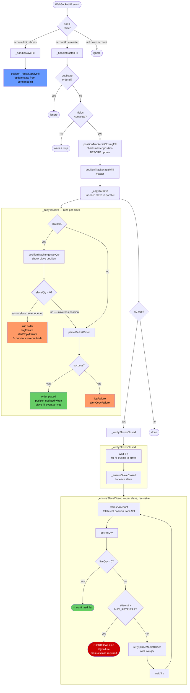

# CopyEngine Logic Flow

```mermaid
flowchart TD
    WS([WebSocket fill event]) --> onFill

    onFill{onFill\nrouter}
    onFill -->|accountId = master| MASTER[_handleMasterFill]
    onFill -->|accountId in slaves| SLAVE[_handleSlaveFill]
    onFill -->|unknown account| IGN([ignore])

    %% ── Slave fill path ──────────────────────────────────────────────
    SLAVE --> SL1[positionTracker.applyFill\nupdate state from confirmed fill]

    %% ── Master fill path ─────────────────────────────────────────────
    MASTER --> DUP{duplicate\norderId?}
    DUP -->|yes| IGN2([ignore])
    DUP -->|no| FIELDS{fields\ncomplete?}
    FIELDS -->|no| WARN([warn & skip])
    FIELDS -->|yes| ICF[positionTracker.isClosingFill\ncheck master position BEFORE update]
    ICF --> APM[positionTracker.applyFill\nmaster]
    APM --> PAR[_copyToSlave\nfor each slave in parallel]

    PAR --> ISCLOSE{isClose?}
    ISCLOSE -->|yes| VFY[_verifySlavesClosed]
    ISCLOSE -->|no| DONE([done])

    %% ── _copyToSlave ─────────────────────────────────────────────────
    subgraph CTS [_copyToSlave — runs per slave]
        direction TB
        CG{isClose?} -->|yes| GNQ[positionTracker.getNetQty\ncheck slave position]
        GNQ --> FLAT{slaveQty = 0?}
        FLAT -->|yes — slave never opened| SKIP[skip order\nlogFailure\nalertCopyFailure\n⚠️ prevents reverse trade]
        FLAT -->|no — slave has position| ORD[placeMarketOrder]
        CG -->|no| ORD
        ORD --> OK{success?}
        OK -->|yes| NOTE[order placed\nposition updated when\nslave fill event arrives]
        OK -->|no| FAIL[logFailure\nalertCopyFailure]
    end

    PAR --> CTS

    %% ── _verifySlavesClosed ──────────────────────────────────────────
    subgraph VSC [_verifySlavesClosed]
        direction TB
        W1[wait 3 s\nfor fill events to arrive] --> ESC[_ensureSlaveClosed\nfor each slave]
    end

    VFY --> VSC

    %% ── _ensureSlaveClosed ───────────────────────────────────────────
    subgraph ESC_BOX [_ensureSlaveClosed — per slave, recursive]
        direction TB
        RA[refreshAccount\nfetch real position from API] --> LQ[getNetQty]
        LQ --> ZERO{liveQty = 0?}
        ZERO -->|yes| CFLT([✓ confirmed flat])
        ZERO -->|no| MAXR{attempt >\nMAX_RETRIES 2?}
        MAXR -->|yes| CRIT([🚨 CRITICAL alert\nlogFailure\nmanual close required])
        MAXR -->|no| RETRY[retry placeMarketOrder\nwith live qty]
        RETRY --> W2[wait 3 s]
        W2 --> RA
    end

    ESC --> ESC_BOX

    %% ── Styling ──────────────────────────────────────────────────────
    style SKIP fill:#f96,color:#000
    style FAIL fill:#f96,color:#000
    style CRIT fill:#c00,color:#fff
    style CFLT fill:#6c6,color:#000
    style NOTE fill:#6c6,color:#000
    style SL1  fill:#69f,color:#000
```
